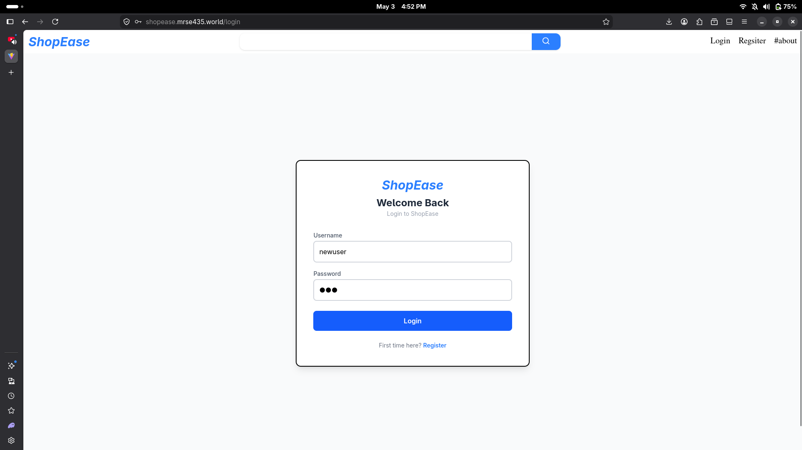
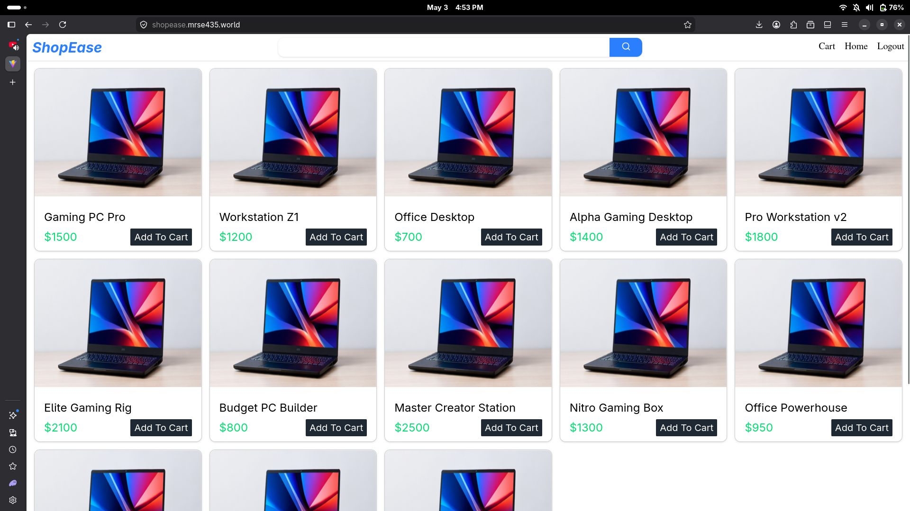
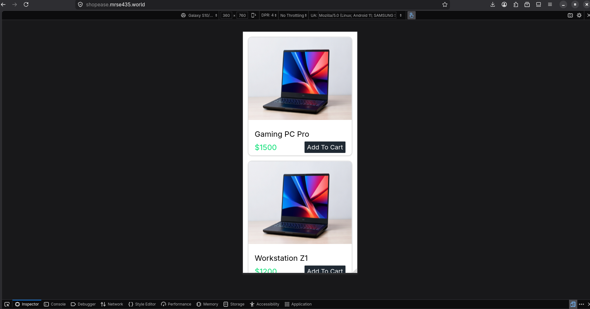
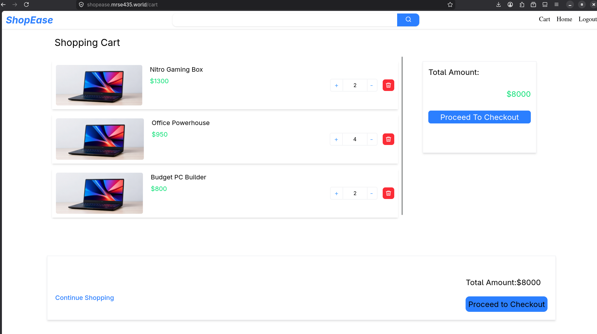
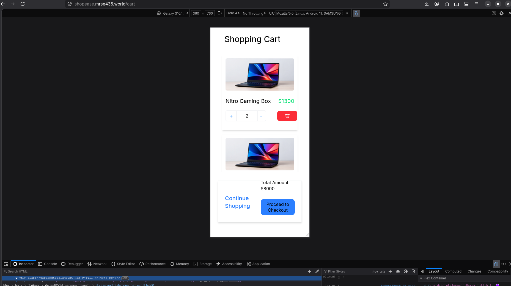
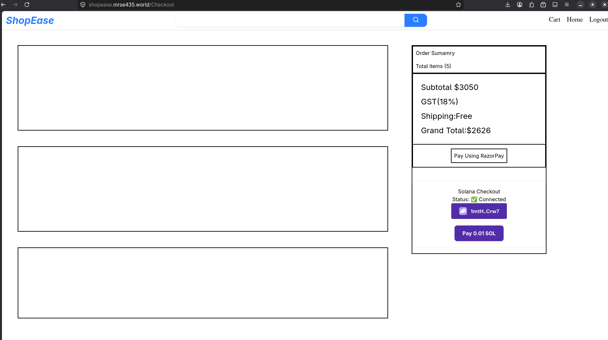
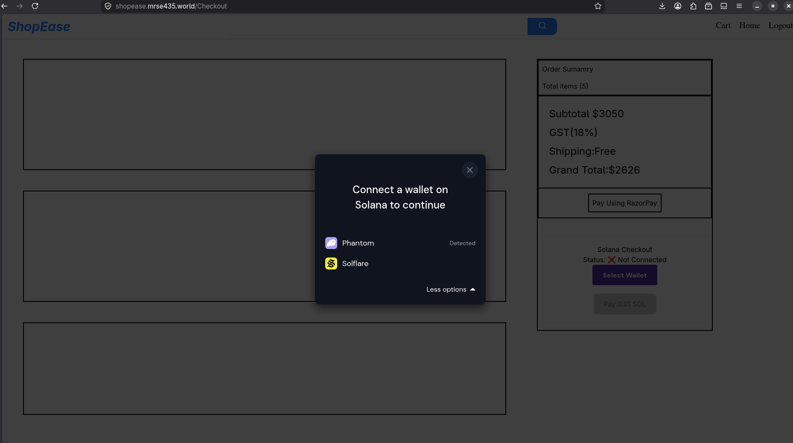

<div align="center">

# 🛒 ShopEase

### Full Stack E-Commerce Platform with Web3 Crypto Payments

[](https://shopease.mrse435.world)
[](https://github.com/MRSE435/ecomfrontend)
[](https://github.com/MRSE435/ecombackend)

<br/>

> A **production-deployed** full stack e-commerce platform featuring session authentication, dynamic product catalogue, shopping cart with cross-tab sync, and a **dual payment system** — pay with RazorPay or directly with **Solana crypto wallet**.

</div>

---

## 📸 Screenshots

### 🔐 Login


---

### 📝 Register


---

### 🏠 Home — Product Catalogue


---

### 📱 Home — Mobile Responsive


---

### 🛒 Shopping Cart


---

### 📱 Cart — Mobile Responsive


---

### 💰 Checkout — Dual Payment System


---

## ⛓️ Web3 Solana Payment Flow

> The most unique feature of ShopEase — real blockchain crypto payments in a standard e-commerce app

### Step 1 — Connect Your Wallet


*User clicks "Connect Wallet" → modal shows Phantom (Detected) and Solflare options*

---

### Step 2 — Confirm Transaction in Phantom


*Phantom extension opens → displays network, fee, and domain → user clicks Confirm to sign and broadcast the transaction on Solana*

---

### Step 3 — Payment Confirmed On-Chain ✅

*Transaction is signed, sent to Solana Devnet, confirmed by validators → unique signature returned as receipt*

---

## ✨ Full Feature List

| Feature | Details |
|---|---|
| 🔐 Authentication | Session-based register/login/logout with secure httpOnly cookies |
| 🛍️ Product Catalogue | Products fetched dynamically from MongoDB |
| 🛒 Shopping Cart | Add, increment, decrement, delete items with live total |
| 🔄 Cross-Tab Sync | Cart updates instantly across all open browser tabs via BroadcastChannel API |
| 💳 RazorPay | Traditional payment gateway integration |
| ⛓️ Solana Web3 | Connect Phantom or Solflare — pay with real SOL on blockchain |
| 🔒 Protected Routes | Auth guard redirects unauthenticated users to login |
| 📱 Fully Responsive | Tested on mobile, tablet, and desktop |
| 🌐 Custom Domain | Live at shopease.mrse435.world with DNS configured on GoDaddy |

---

## 🚀 Tech Stack

### Frontend


### Backend


### Web3 / Blockchain


`@solana/web3.js` `@solana/wallet-adapter-react` `PhantomWalletAdapter` `SolflareWalletAdapter`

### DevOps & Deployment


---

## 🏗️ System Architecture

```
┌──────────────────────────────────────────────────────┐
│                      FRONTEND                        │
│            React + Vite + Tailwind CSS               │
│        shopease.mrse435.world  (Render CDN)          │
└─────────────────────┬────────────────────────────────┘
                      │  HTTP REST API
                      │  credentials: include  (cookies)
┌─────────────────────▼────────────────────────────────┐
│                      BACKEND                         │
│               Node.js + Express.js                   │
│           ecombackend-gso3.onrender.com              │
└─────────────────────┬────────────────────────────────┘
                      │  Mongoose ODM
┌─────────────────────▼────────────────────────────────┐
│                    DATABASE                          │
│                 MongoDB Atlas                        │
│       Collections: users │ products │ carts          │
└──────────────────────────────────────────────────────┘

┌──────────────────────────────────────────────────────┐
│               WEB3 PAYMENT LAYER                     │
│                                                      │
│  1. User connects Phantom or Solflare wallet         │
│  2. Transaction built using @solana/web3.js          │
│  3. User signs in Phantom browser extension          │
│  4. Transaction broadcast to Solana Devnet           │
│  5. Confirmed by network validators                  │
│  6. Signature returned as payment receipt            │
└──────────────────────────────────────────────────────┘
```

---

## ⛓️ Solana Payment — Code

```javascript
// Step 1 — Wrap app with Solana providers
const network = WalletAdapterNetwork.Devnet
const endpoint = useMemo(() => clusterApiUrl(network), [network])
const wallets = useMemo(() => [
  new PhantomWalletAdapter(),
  new SolflareWalletAdapter()
], [])

// Step 2 — Build and send transaction
const transaction = new Transaction()
transaction.add(
  SystemProgram.transfer({
    fromPubkey: publicKey,                          // user's wallet
    toPubkey: new PublicKey("MERCHANT_ADDRESS"),    // store wallet
    lamports: 0.01 * LAMPORTS_PER_SOL              // 0.01 SOL
  })
)

// Step 3 — Sign in Phantom and confirm on-chain
const signature = await sendTransaction(transaction, connection)
await connection.confirmTransaction(signature, 'confirmed')
// signature = unique blockchain receipt for this payment
```

---

## 🔄 Cross-Tab Cart Sync — Code

```javascript
// After every cart change — broadcast to all open tabs
const cartChannel = new BroadcastChannel('cart_sync')
cartChannel.postMessage('update')

// Every open tab listens and re-fetches cart automatically
cartChannel.addEventListener('message', () => fetchcart())
```

---

## 🌐 API Endpoints

| Method | Endpoint | Description | Auth Required |
|---|---|---|---|
| `POST` | `/api/register` | Register new user | ❌ |
| `POST` | `/api/login` | Login and create session | ❌ |
| `POST` | `/api/logout` | Destroy session | ❌ |
| `GET` | `/api/checkauth` | Verify session status | ❌ |
| `GET` | `/api/products` | Get all products | ✅ |
| `GET` | `/api/fetchcart` | Get user's cart (populated) | ✅ |
| `POST` | `/api/handlecart` | Add / increment cart item | ✅ |
| `POST` | `/api/decrementcart` | Decrement item quantity | ✅ |
| `POST` | `/api/deleteitemfromcart` | Remove item from cart | ✅ |

---

## ⚙️ Local Setup Guide

### Prerequisites
```
Node.js v18+
MongoDB Atlas account (free tier works)
Phantom wallet browser extension
```

### 1. Clone Both Repos
```bash
git clone https://github.com/MRSE435/ecomfrontend
git clone https://github.com/MRSE435/ecombackend
```

### 2. Backend Setup
```bash
cd ecombackend
npm install
```

Create `.env` file:
```env
DATABASE_URL=your_mongodb_atlas_uri
PORT=3000
NODE_ENV=development
```

```bash
node index.js
# ✅ Server running at http://localhost:3000
# ✅ database connection successfully
```

### 3. Frontend Setup
```bash
cd ecomfrontend
npm install
```

Create `.env` file:
```env
VITE_API_URL=http://localhost:3000
```

```bash
npm run dev
# ✅ App running at http://localhost:5173
```

### 4. Test Solana Payments Locally
```
1. Install Phantom from https://phantom.app
2. Create a new wallet
3. Go to Settings → Developer Settings → Switch to Devnet
4. Get free test SOL from https://faucet.solana.com
5. Connect wallet on the checkout page and test payment
```

---

## 📁 Project Structure

```
ecomfrontend/
├── src/
│   ├── components/
│   │   ├── Navbar.jsx           ← navigation bar
│   │   ├── CardsComponent.jsx   ← product grid
│   │   ├── cart.jsx             ← shopping cart
│   │   ├── Checkout.jsx         ← checkout + dual payments
│   │   ├── login.jsx            ← login form
│   │   ├── register.jsx         ← register form
│   │   ├── Solbutton.jsx        ← Solana wallet providers wrapper
│   │   └── protectedroute.jsx   ← auth guard
│   ├── App.jsx                  ← global state + routes
│   └── main.jsx
├── .env                         ← never commit this
└── .gitignore

ecombackend/
├── index.js      ← Express server + all API routes + MongoDB schemas
├── public/       ← product images served statically
├── .env          ← never commit this
└── .gitignore
```

---

## 🌟 What Makes This Project Stand Out

```
⭐ Real Solana Web3 payments    — most students never touch blockchain
⭐ Dual payment system          — RazorPay + Solana in same app
⭐ Cross-tab cart sync          — production-level BroadcastChannel pattern
⭐ Secure cookie auth           — httpOnly + secure + sameSite configured
⭐ Custom domain live           — shopease.mrse435.world with DNS setup
⭐ Fully responsive             — mobile and desktop tested
⭐ Protected routes             — proper auth guards on frontend
⭐ Production deployed          — real live app, not just localhost
```

---

<div align="center">

## 👨‍💻 Author

**Mohammed Owais**

*BCA Student — Presidency College, Bangalore | 

[](https://github.com/MRSE435)
[](https://www.linkedin.com/in/mohammed-owais-66053a2a0/)
[](https://mrse435.world)

---

*If you found this project interesting, please consider giving it a ⭐*

</div>